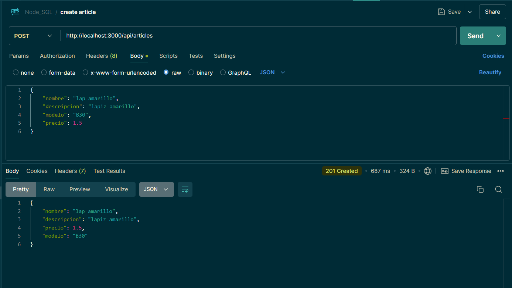
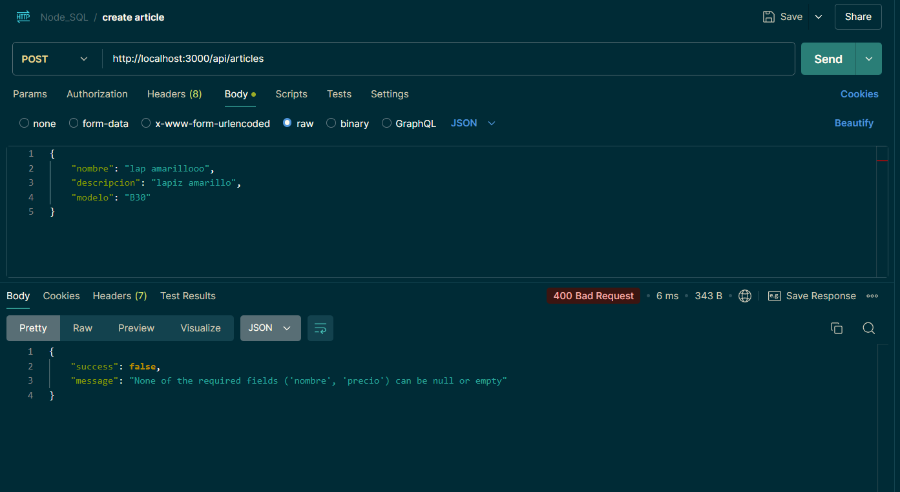
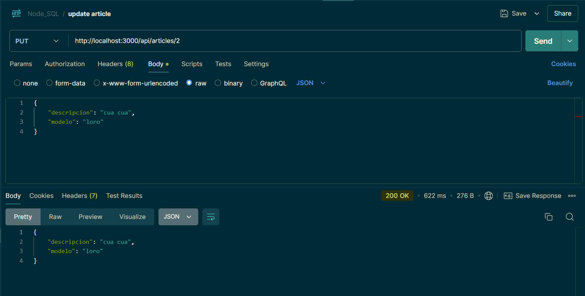
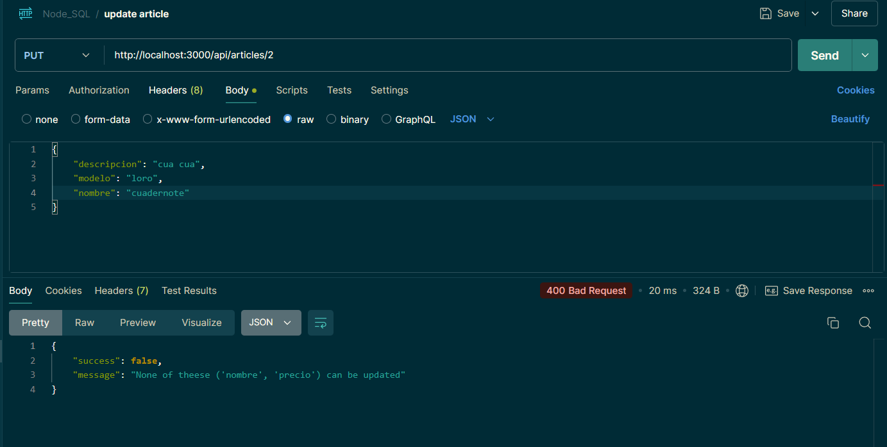
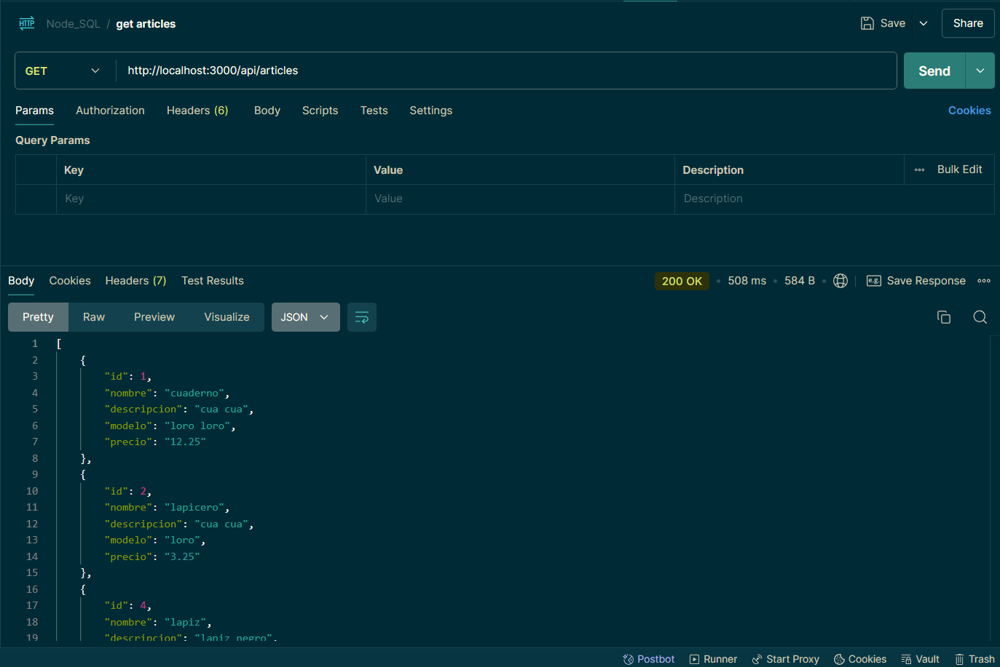
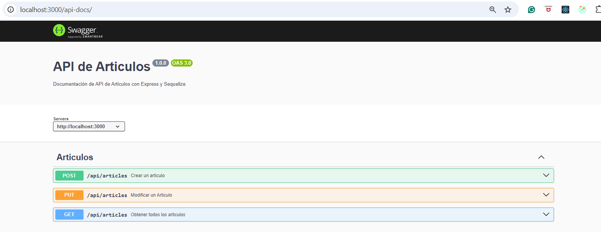

# Node.js Challenge
REST API usando Express Framework para mantenimiento de Articulos, conectandose a un RDS de la nube de AWS que contiene una base de datos SQL(MySQL) y utilizando un ORM(Sequelize) para el manejo de Repositorios, ademas se siguen los principios RESTful.
Se utiliza la libreria webpack para el empaquetado del proyecto lo que facilita el despliegue al tener pocos archivos


## Stack
- Express
- MySQL
- AWS

## APIs
- GET: /api/articles/
- POST: /api/articles/
- PUT: /api/articles/{id}

## Configuracion
1. Una vez se tiene el acceso al RDS, crear un archivo .env en la raiz. Conteniendo los sgtes parametros:
```bash
APP_PORT=3000
DB_HOST=database.c3oweD0Know.us-east-2.rds.amazonaws.com
DB_PORT=3306
DB_USER=admin
DB_PASSWORD=password
DB_NAME=almacen
DB_DIALECT=mysql
DB_TIMEZONE=-05:00
```
2. Ejecutar el siguiente script de creacion de tablas [Script Creacion tablas](script.sql)
3. Continuar con los pasos para desplegar en ambiente local
4. El empaquetado se genera en la ruta /dist/bundle.js que podra ser desplegado en la nube posteriormente.


## Despliegue en ambiente local
1. Instalar dependencias:
```bash
npm i
```
2. Compilar empaquetado:
```bash
npm run build
```
3. Iniciar servidor web:
```bash
npm run start
```

## Documentacion
Using swaggerUI express, API documentation will be in the following path
http://localhost:3000/api-docs/


## Evidencias de Funcionamiento
- API Crear Articulo - Exitoso


- API Crear Articulo - Error Validacion


- API Actualizar Articulo - Exitoso


- API Actualizar Articulo - Error Validacion


- API Listar Articulos


- API Documentacion

